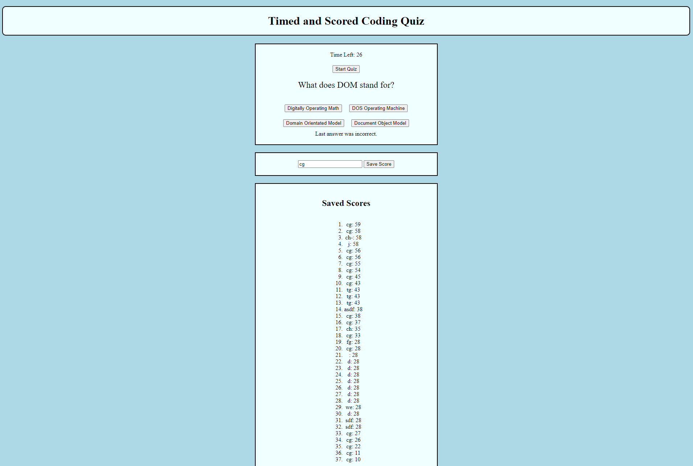

# Coding Quiz

## Description

This application is a brief quiz that show cases the capabilities of java script and web api while providing a fun and educational quiz. The quiz is four questions long with four choices per question. The quiz is timed, giving you 60 seconds to complete the quiz. For each missed answer you are docked 10 seconds. The quiz is scored by how long it takes you to complete it. After completing the quiz you enter you initials and your name and score is added to the leader board.

- The motivation to create this application was to build of my previous knowledge of Java script and to practice my new knowledge of web api

- I build to project to challenge my self to use the resources available to me to create an complete and interactive web page.

- The project solves the problem of not having a method by which to quiz oneself.

- What i learned from the project is how to use web api to locally store data, use event listeners, use interval functions, use JSON, and other java script and web api tools.

## Credits
Ross, Meg M, MDN, Stack Over Flow, CHAT GPT, EdX BootCamp